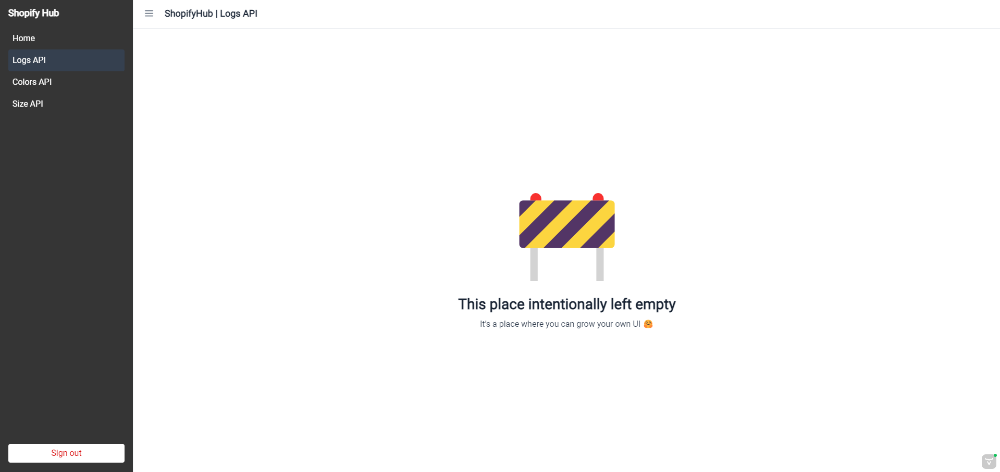
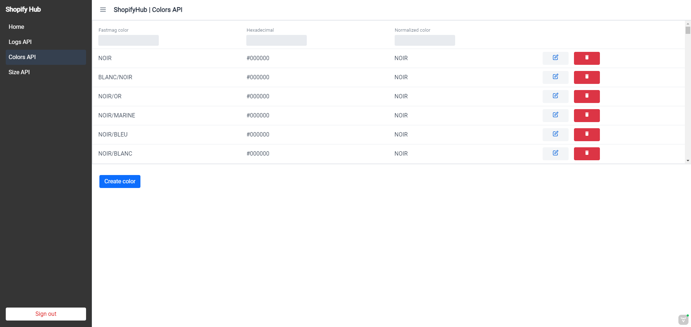
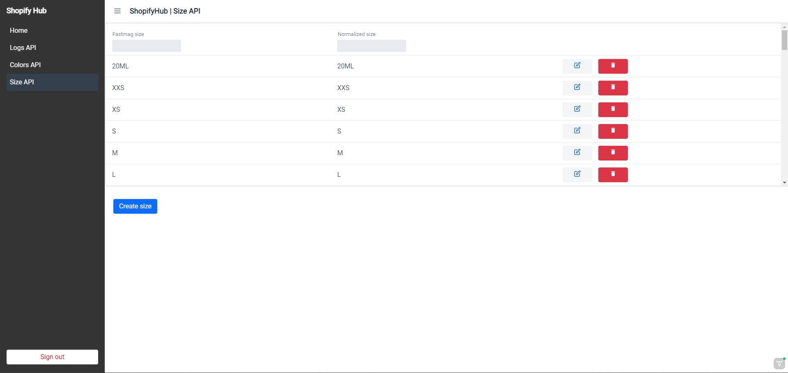
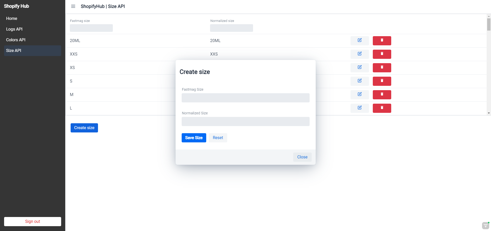
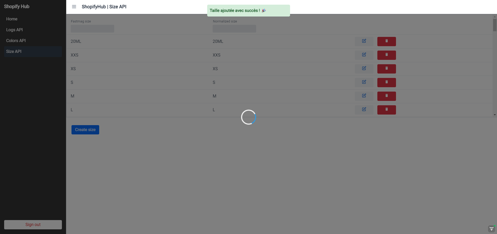
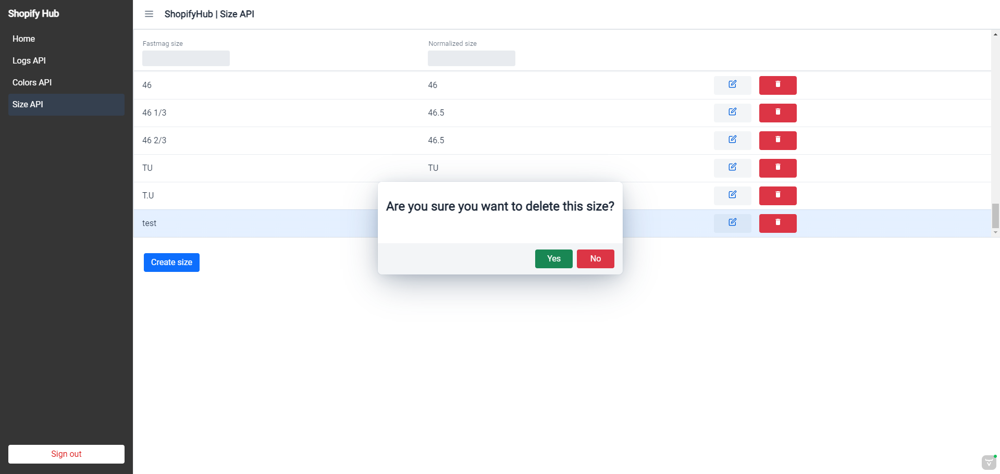

##### Introduction
This document presents the Shopify Hub project, carried out as part of the Master 2 IT Systems Expert course at Ingetis
Paris. This project was carried out in collaboration with the company COGENIO under a work-study contract.
  

##### Targets
The Shopify Hub project aims to :
- Develop a back office for the Cashville website, a streetwear e-commerce site.
- Implement CRUD (Create, Read, Update, Delete) functions for managing colours and sizes.
- Have a system that filters and displays logs for all services: Fastmag, Bigcommerce, Jobs, Shopify.
- Enable stock and inventory management for Cashville's physical shops as well as B2, formerly Stergan, another
streetwear e-commerce site.
  

##### Technology
The Shopify Hub project was developed using the following technologies:
- Back-end: Java Spring Boot
- Front-end: Hilla (Vaadin)
  

##### Conclusion
The Shopify Hub project is a comprehensive, high-performance tool for managing Cashville's back office and centralising
stocks and inventories for its various shops. The project has been developed using modern technologies and meets the
company's specific needs.
  

##### Appendices

  

    <input type="radio" name="slider" id="item-1" checked>
    <input type="radio" name="slider" id="item-2">
    <input type="radio" name="slider" id="item-3">
    

      <label class="card" for="item-1" id="bo-1">
        
      </label>
      <label class="card" for="item-2" id="bo-2">
        
      </label>
      <label class="card" for="item-3" id="bo-3">
        
      </label>
    

  

  

    

      
    

    

      
    

    

      
    

        

      
    

