##### Introduction
This document presents the E-Travel project, carried out as part of the Master 1 IT Systems Expert course at Ingetis Paris. This year-long project is part of an innovative teaching approach designed to put students in real-life start-up situations.
  

##### Role and team
I was project manager and front-end lead developer in a team of 3 students.
  

##### Targets
E-Travel aims to simplify travel planning by offering an all-in-one platform for :
- View flight tickets, accommodation and activities.
- Compare flight and accommodation prices to find the best deals.
- Plan your entire trip, from A to Z.
- Preview your itinerary even if your internet connection is down.
  

##### Tools and technologies
The E-Travel project was developed using the following tools and technologies:
- Agile methodology: Trello (Kanban)
- Hosting: Azure
- Database: Metabase
- Front-end: Next.js, React
- Back-end: Nest.js
  

##### Synopsy
E-Travel makes it easy for you to plan your trip by offering an integrated viewing system for flight tickets, accommodation and activities, with price comparators for flights and accommodation to save you money. You can plan your trip from A to Z with an itinerary preview available in the event of internet failure.
  

##### Appendices
This document is a summary of the project. The project is currently no longer hosted.
The project source code is available on [GitHub](https://github.com/ProximaPolaris/etravel).
  

##### Design

  

    

      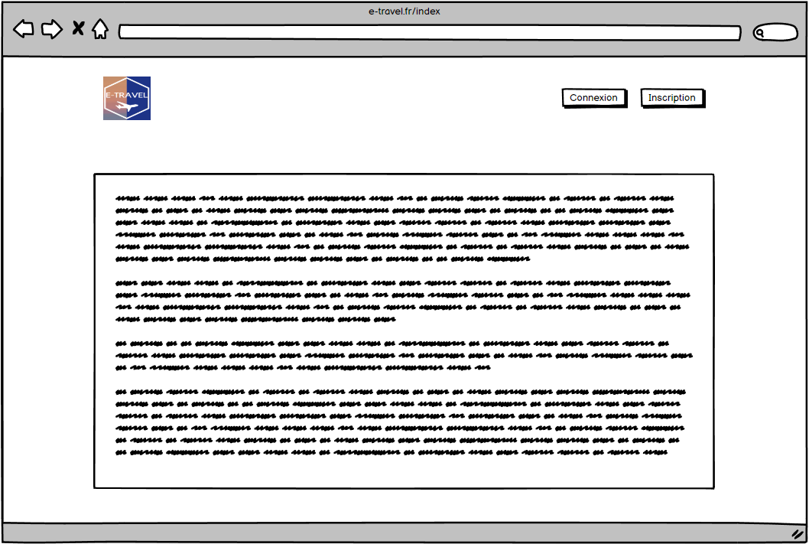
    

    

      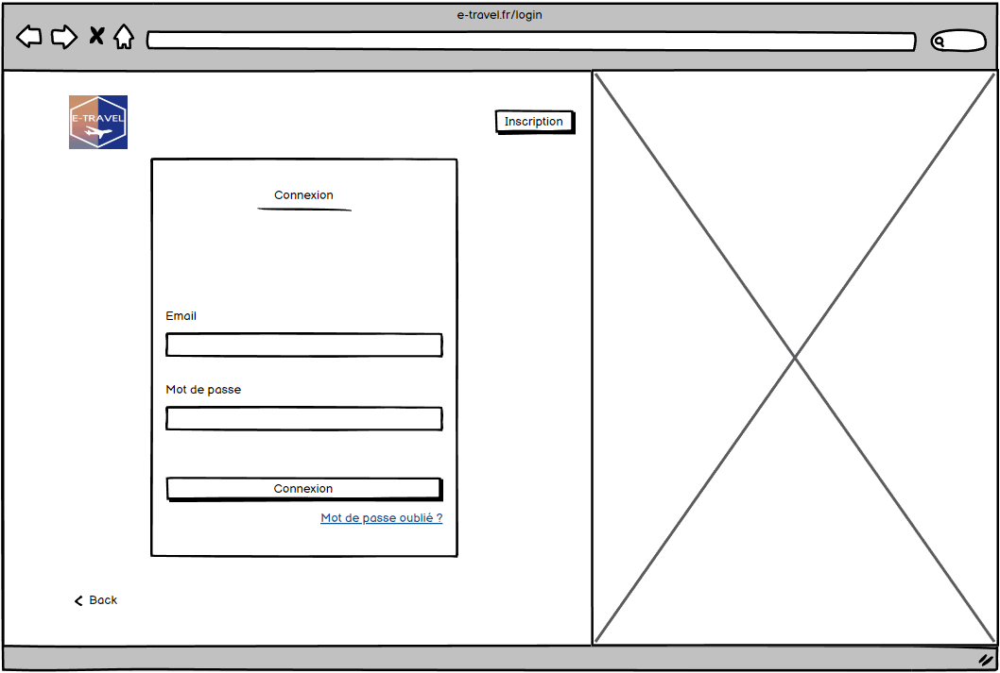
    

    

      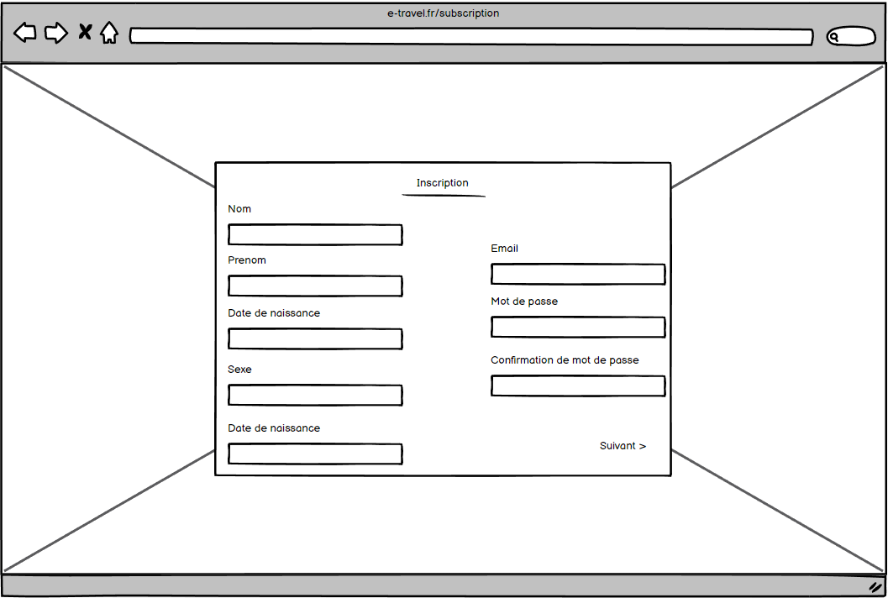
    

        

      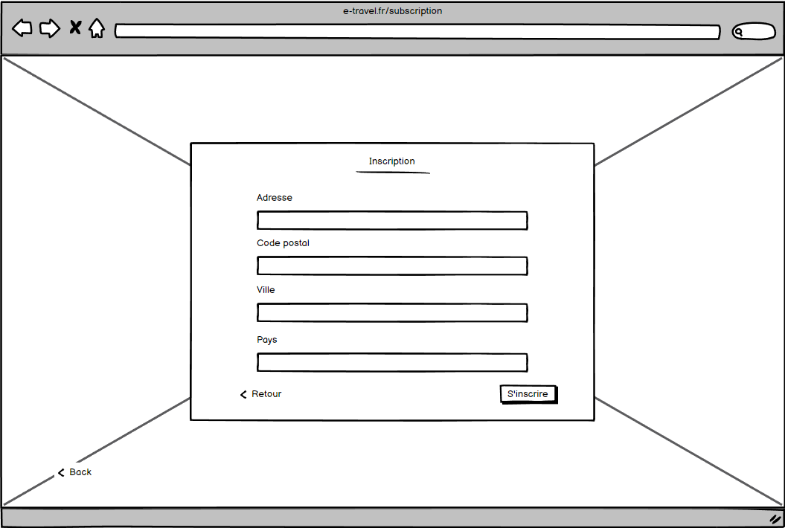
    

        

      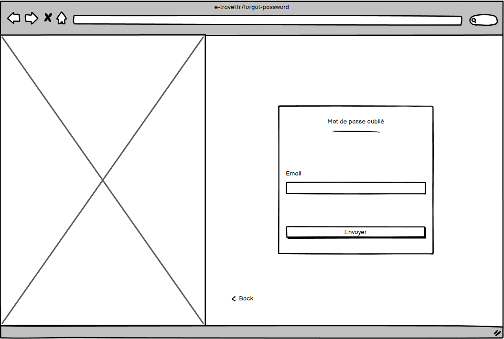
    

        

      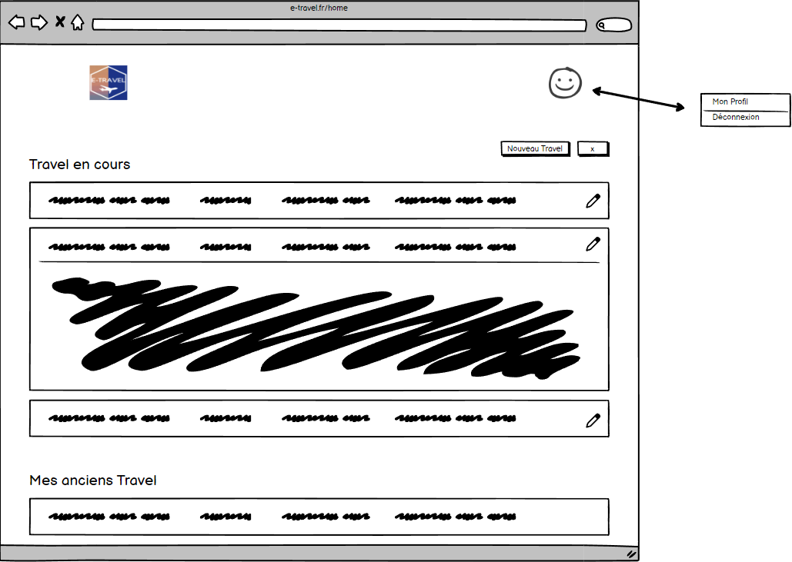
    

        

      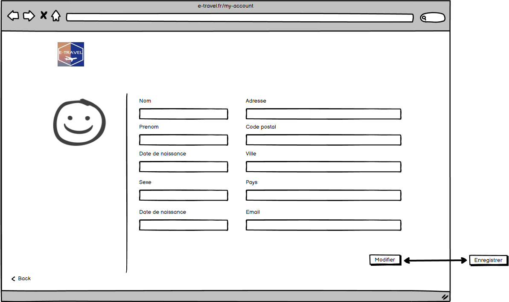
    

        

      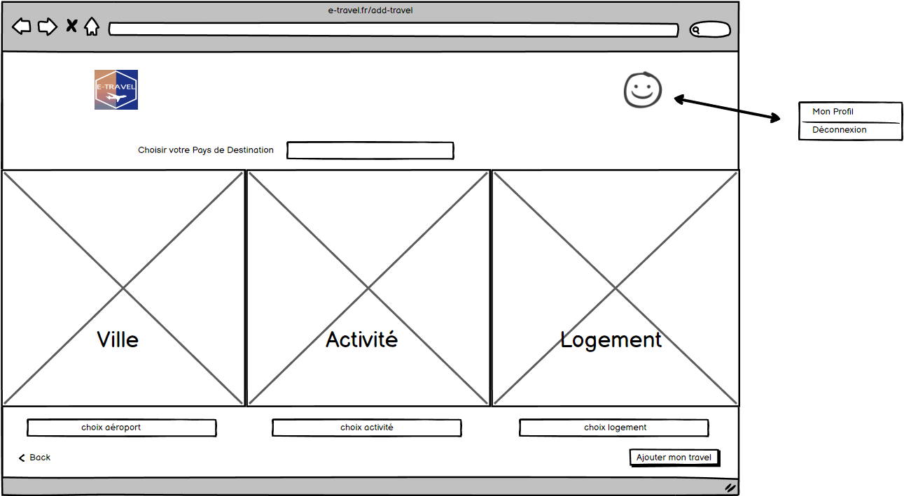
    

        

      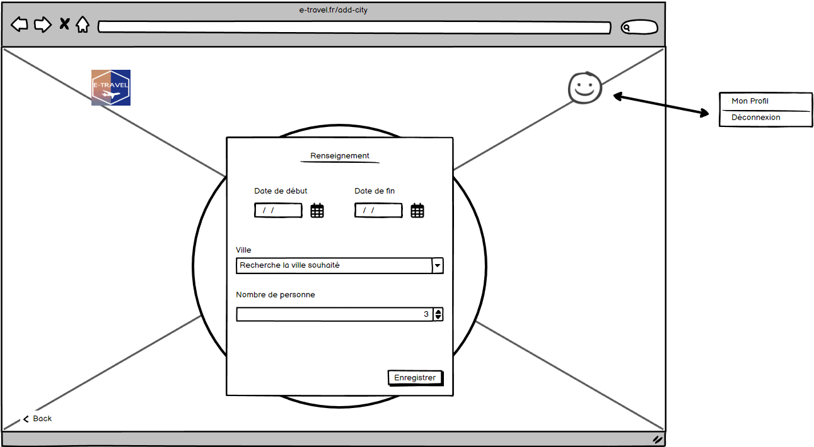
    

        

      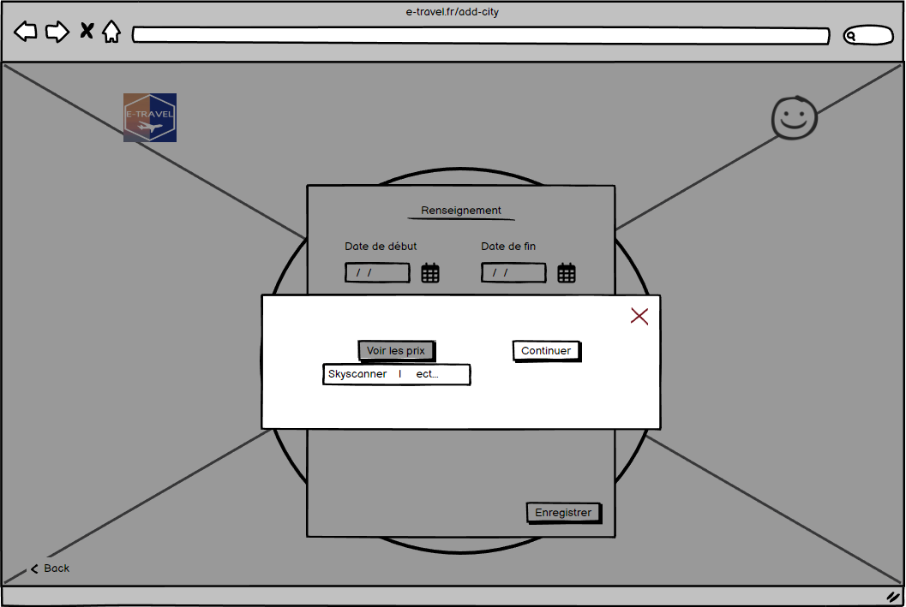
    

        

      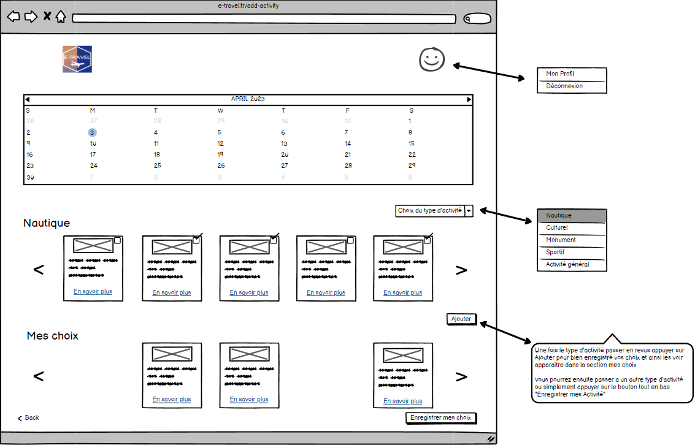
    

        

      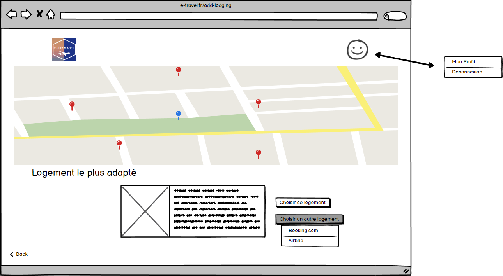
    

